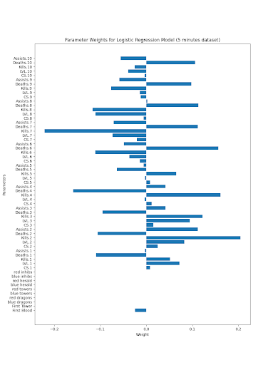
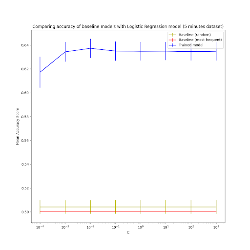
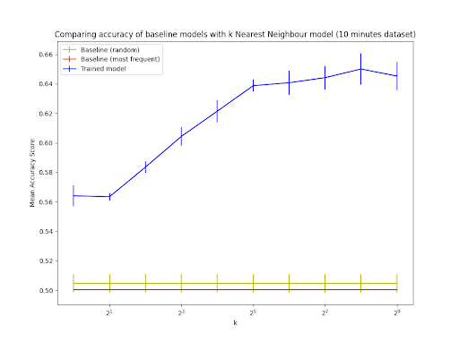
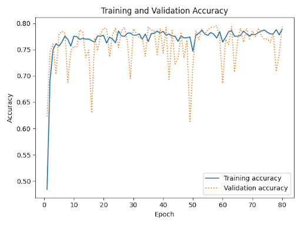
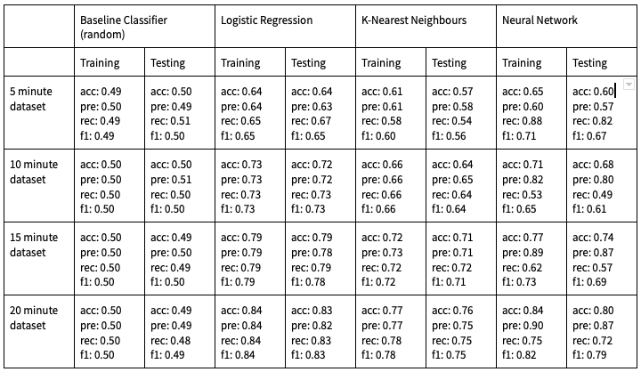
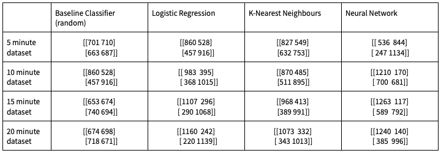
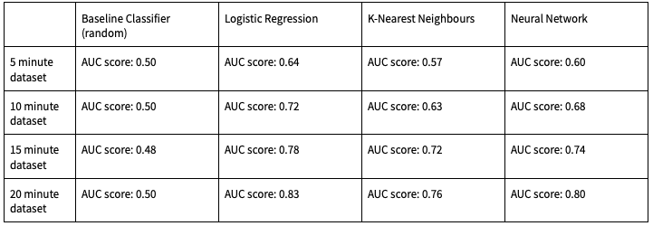
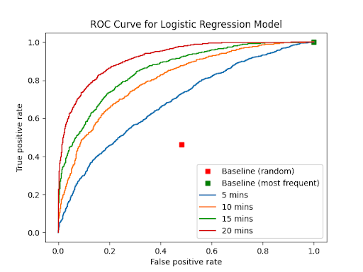
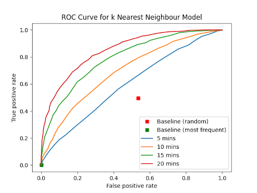

# Machine Learning for Gamers
## Introduction
League of Legends (LoL) is a video game where two teams of five players compete against each other in an online arena. In the competitive "Ranked" mode, the game uses an [ELO system](https://en.wikipedia.org/wiki/Elo_rating_system) to rank players according to their skill level. In the interest of balance, players' rankings are used in the matchmaking process to ensure teams of similar skill levels are pitted against eachother.

After a "Ranked" match, players gain or lose points in the ranking system based only on whether they won or lost. The idea for these experiments was derived from a feature that allows teams to forfeit a match after 15 minutes have passed. If all players on a team agree to surrender, then the match immediately ends.

The aim of this project is to predict the outcome of a match as soon as possible, based only on information that is visible to  players. This is useful, as players gain or lose the same amount of points in the ranking system regardless of match length or individual performance. There is no reward for continuing to play a match that will eventually be lost, so a team can quickly win back their lost ranking points by forfeiting as soon as possible. By maximising the number of matches played in a day, players can gain more ranking points overall (assuming a positive win rate) and thus it is often optimal to surrender matches that cannot be won.

By applying this problem to the highest ranked players, data consistency can be ensured as high-level play can be expected in matches. Also, models will be applicable to the players most likely to use them. For this project, the state of a match at 5 minutes, 10 minutes, 15 minutes and 20 minutes were analysed. 

## Dataset and Features
The dataset consists of a collection of 13,803 unique matches of League of Legends. For each match, there are separate datasets for the visible statistics at 5 minutes, 10 minutes, 15 minutes and 20 minutes. The data for each match was collected via the Riot Games API. The process was as follows:

- Use the Riot Games API to get a list of the highest ranked players in a given region (Europe, North America, etc.).
- Fetch each players' 100 most recent matches using the time_line API endpoint.
  - The time_line API endpoint returns the state of a match at every minute along with every event that occured in that minute.
- Parse the data into a useful format.

The Riot Games API allows a maximum of 50 requests per minute. This rate limit was a major inhibiting factor in the data gathering process. The issue of duplicate data being gathered was also encountered, as a single match can feature multiple players from the dataset and thus is fetched more than once. It was observed that roughly 50% of the matches fetched from the API were discarded as duplicates. These factors combined meant that gathering a dataset of 13,000 matches took roughly 8.7 hours.

Initially post-match data was analysed and models were created that could predict the winner with an accuracy of above 90%. While this is an impressive result, it was decided that this was not a useful application. Predicting the result of a match after completion is not as impactful or interesting as making predictions while it is in progress.

There are four major ways to gain an advantage in a match. These are as follows: 
- killing enemy players
- destroying enemy towers
- completing objectives (like killing large monsters)
- killing enemy minions.  

Information about these advantages are visible as match statistics that are always available to the players. For every interval, the following data was gathered:
- the number of towers destroyed by each team
- the number of objectives completed by each team
- the number of player kills and assists achieved by each player
- the number of deaths of each player
- the number of enemy minions slain by each player

Each of these is used as a feature for our models leading to 60 features total. The Riot Games API returns a lot of information about a match that players do not have access to but it was decided that using this data would detract from the desired applications real-world use-case.

Some other interesting features were initially analysed but eventually dropped due to a lack of data samples. For example, each player selects a character from around 150 possible characters. This can have an impact on the outcome of a match, but with all 10 players choosing 1 of 157 characters, a significant order of magnitude more data is needed to analyse character choice in a meaningful way.

## Methods
### Logistic Regression Classifier
A logistic regression classifier is a linear model that makes use of the following equation,

$\theta^{T}x = \theta_{0}x_{0} + \theta_{1}x_{1} + ... + \theta_{n}x_{n}$

where $x_{0}=1$, $x_{1}, ..., x_{n}$ are input features and $\theta_{0}, ... \theta_{n}$ are unknown model parameters. As such, $\theta^{T}x$ is the weighted combination of the input features. In a binary classifier, predictions of either $-1$ or $+1$ are made and the model used to make such predictions is $sign(\theta^{T}x)$. Logistic regression seeks to select values of $\theta$ that minimise a cost function, $J(\theta)$, to increase the accuracy of predictions. Generally, this is done using gradient descent.

Scikit-learn provides a LogisticRegression classifier that uses an L2 penalty to reduce overfitting equal to the square of the magnitude of coefficients. The weight of this penalty, $C$, should be determined through cross-validation.

### K-Nearest Neighbours Classifier
K-nearest neighbours is a non-parametric classification method which uses the training data alone to make predictions of $-1$ or $+1$. The model determines the $k$ nearest points in the training data for an input vector $x$, and makes a prediction for $x$ based on the majority vote of the given neighbours. As such, an odd number for $k$ is used to ensure that a decision is made.

Scikit-learn provides a KNeighborsClassifier that uses the Euclidean distance formula to determine the $k$ nearest neighbors to an input vector $x$. The value of $k$ should be determined through cross-validation. For this project, the predictions should be made based on the majority vote, so there is no need for Gaussian weighting i.e, the weight parameter is set to uniform.

### Neural Network for Binary Classification
Neural networks consist of input layers, hidden layers and output layers. Data is passed from the input layers to the hidden layers, which use activation functions to produce outputs that are passed to more hidden layers or to a final output layer. 

Neural networks are often used for regression problems but they can be modified to work for binary classification by the use of two fully connected layers. In the fully connected layers, each output is a function of a weighted sum of the inputs. The first layer takes in all of the features and uses relu activation to produce a series of outputs. These are then passed to the second fully connected layer, which uses sigmoid activation to reduce the outputs to values between 0.0 and 1.0.

Neural networks can be implemented in python by using Keras and TensorFlow. A binary classifier neural network consists of two dense layers, one using relu activation and the other using sigmoid as well as a binary_crossentropy loss function.

## Experiments
For each of the experiments below, 5-fold cross-validation was used where appropriate to determine optimal values for hyperparameters. 5-fold cross-validation was used to keep computational time low (using 10-fold cross-validation took much longer to train all models) and because each fold has enough training and testing data to reduce the effect of underfitting. 

The models were assessed using the following metrics:
- Accuracy: The number of correct predictions divided by the number of predictions made. This metric can help identify overfitting in the training data by comparing accuracy scores for the training and test data.
- Precision: The number of true positive predictions divided by the number of all positive predictions. This is the model's ability to avoid predicting a negative datapoint as positive.
- Recall: The number of true positive predictions divided by the number of positive data points. This is the model's ability to correctly predict all positive data points.
- F1 Score: The harmonic mean of precision and recall.
- AUC (Area Under Curve): A higher AUC score means that the model is better equipped to distinguish between the positive and negative classes.

### Logistic Regression Classifier
In logistic regression, gradient descent is used as an optimisation algorithm to select the model parameters, $\theta$, that minimise the cost function, $J(\theta)$. We created logistic regression models for each of the datasets, which gave different values for $\theta$. Here is an example graph, which shows the value of $\theta_{i}$ for each input feature in the dataset of game statistics at 5 minutes. 

Logistic regression uses an L2 penalty. The hyperparameter $C$ determines the strength of the regularisation terms of the L2 penalty and was chosen by cross-validation. Care was taken to consider a wide range of appropriate $C$ values; the following were considered for each of the four datasets:

$C=[0.0001, 0.001, 0.01, 0.1, 1, 10, 100, 1000]$

Here is an example graph, which shows the mean accuracy and standard deviation of a logistic regression model with different values of C for the dataset of game statistics at 5 minutes. Also on the graph are plots for two baseline classifiers: one which chooses a random outcome and one which chooses the most frequent outcome in the dataset.

A C value of 0.01 was chosen for the datasets of game statistics at 5, 15, and 20 minutes and a C value of 1 was chosen for the dataset of game statistics at 10 minutes. This is because they yielded the most accurate models with the smallest standard deviation.

### K-Nearest Neighbours Classifier
When using a k-nearest neighbours model, the main hyperparameter that can be varied is the value for $k$, which represents the amount of neighbours to be taken into consideration when making a prediction. Since we are not interested in different weight parameters and have the weight parameter set to 'uniform', cross-validation is only required to determine an optimal value for $k$. Cross-validation was initially performed using the following values:

$k=[1, 2, 4, 8, 16, 32, 64, 128, 256, 512]$

Here is an example graph used as a part of cross-validation showing the various values for $k$ plotted along the x-axis. 

The plot shows the mean accuracy along with the standard deviation for the k-nearest neighbours model and the two baseline classifiers discussed earlier for the dataset of game statistics at 10 minutes. 

After this step, further cross-validation was performed in the same way on values around the observed optimal value of $k$ above to determine the most optimal $k$ value. It was observed that $k=521$ was the optimal value for the 5-minute dataset, $k=253$ was the optimal value for the 10 minute dataset and $k=63$ was the optimal value for the 15 and 20 minute datasets.  This is because they yielded the most accurate models with the smallest standard deviation.

### Neural Network for Binary Classification
For neural networks cross-validation is rarely used as it takes too long to train the models. Instead a hold out dataset was used to test various hyperparameters to determine what works best. The hyperparameters tested were batch size, the input size of the first connected layer and the number of epochs. After testing a range of values, a batch size of 256, an input size of 128 and 80 epochs were found to gave the most accurate predictions without leading to overfitting.

Here is a graph that shows the accuracy of predictions for the 15 minutes dataset after every epoch. From this, it is observed that the model becomes more accurate every epoch.

## Results
### Metrics 
The datasets were split into 80% training data and 20% test data. In the following table, to make everything fit, the following acronyms are used:
- acc (accuracy score)
- pre (precision score)
- rec (recall score)
- f1 (F1 score)

Overall, the logistic regression model had the best performance. Across all models, the difference in metrics between training and testing data was relatively small, which indicates a lack of overfitting. As expected, the performance of the models increased as the length of time into a match increased. It is interesting to note that the neural network performs well but is much less consistent in its metrics than the logistic regression and k-nearest neighbours models. It is surprising to see that the logistic regression model can predict the outcome of a match with 64% accuracy only 5 minutes in. This would indicate that even a slight early lead in a match can significantly increase your chance of winning.

We used two baseline models in our experiments: one which chooses a random outcome and one which chooses the most frequent outcome in the dataset. In the table above, only the results of the random baseline classifier are listed to save space, but the classifier that picks the most frequent target performed about the same. It is clear that the other models vastly outperform the baseline classifiers, especially as the length of time in the game increases.

### Confusion Matrices 

The above confusion matrices have the following layout:

[True Negatives, False Positives]  
[False Negatives, True Positives]

These confusion matrices are representative of the model's performance on unseen test data. In most cases, there is a fairly even distribution between true positives and negatives and false positives and negatives. There does not seem to be any bias in the models towards one of the targets, except for the neural network that generally tends to predict one target more than the other (+1 for the 5 minute dataset and -1 for the others). Again, it is clear that the logistic regression model performs better than the other models, and that all of the models outperform the baseline classifier.

### ROC Curves

These Area Under Curve (AUC) scores are representative of a model's performance in predicting target values. An ideal classifier has an AUC score of 1.0 and as seen in the baseline classifier, the AUC score for a random classifier is typically around 0.50. As seen from the results in the table above, the logistic regression model outperformed the other models in this area. The logistic regression model is the closest of our models to an ideal classifier with an AUC score of 0.83 using the 20 minute  dataset. There is also a clear correlation between the AUC scores of the models and the minutes of the game that have been played. The longer the game goes on the accuracy of the predictions generated by each of our models increases, which is to be expected. This correlation can be more clearly seen in the two plots below, which outline the ROC curves for the different datasets for the logistic regression and k-nearest neighbours models:

## Conclusion
The highest performing model was the logistic regression model. The k-nearest neighbours model and the neural network also performed quite well, but did not outperform the logistic regression model in any of the datasets. The biggest revelation of this report is that it is possible to predict the outcome of a game of League of Legends as early as 5 minutes into the game with 63% accuracy! This is much more accurate than originally anticipated for any model this early into a match. 

These models would definitely be a useful tool to highly ranked players who are unsure if they should surrender a game at the 15 minute mark, as our logistic regression model can tell them with around 80% accuracy whether or not they will win. From our limited testing of using the dataset with extended features (including character specific data) we feel the Neural Network would perform extremely well if supplied with a sufficiently large dataset containing all possible features. It outperformed the other models in limited testing scenarios but as stated previously, there was not enough data to accurately train a model with all possible features.